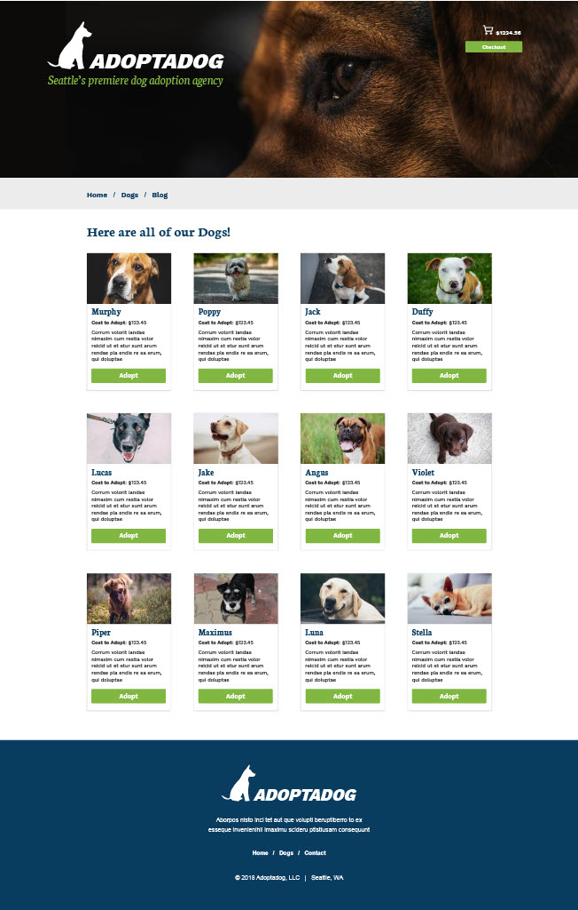

# Adopt-a-Dog Website

Adopt-a-Dog LLC is extending their adoption services to the greater Seattle area through web presence. The upcoming site's [status](#status) is currently in development according to the below [mockups](#mockups) and has an estimated release date of July 2025. <a href="https://kraptastic.github.io/html200-adopt-a-dog/">Visit Work-In-Progress Page, Pardon Our Dust</a>

## Table of Contents

1. [Features/Experience Showcase](#features)
2. [Mockups](#mockups)
3. [Development and Status](#status)
4. [Report Bugs/Contact](#contact)
5. [Testing](#testing)
6. [Links and Thanks](#links)

## Features/Experience Showcase

The site will be designed for mobile devices first, with clear header and footer styling consistent on each page. On the landing page, an immediate path to adoption will be most prominent, with links below to the blog page and the dog profiles page. The user will be channeled to a checkout page when the user has added a dog to the cart and selects the checkout option.

## Mockups (Provided by Adopt-a-Dog LLC Designers)

## Development Status

HTML and base site structure committed May 12
Readme, initial UX/QA testing commit due May 19 and on schedule
CSS and Javascript completion dates to be scheduled
Release date before end of July 2025

## Tech Stack

The site will be primarily constructed from HTML5 and CSS, with some JavaScript for responsiveness and interactivity.

## Bug Report/Contact

Send bugs or comments to sole author Kyle Woodburn at <a href="mailto:kylewb@uw.edu">kylewb@uw.edu</a>
To join the class' unofficial Discord channel, email Kyle at the link above. We appreciate your input and will review any pull requests through GitHub.

## Testing

Testing for the site has been performed through Chrome DevTools. We're supporting major browsers such as Firefox, Chrome, Safari, and Edge and testing each release. <a href="/testing.txt">Click here to see our testing documentation including our user base.</a>

## Links and Acknowledgements

Thanks to Britt, Susan, Pam, and Alton on the class' unofficial discord page for sharing inspiration and supporting each other when we get stumped.

- [ReadMe format inspiration #1](https://github.com/weewx/weewx/blob/master/README.md)
- [ReadMe format inspiration #2](https://github.com/brittrohrer/html200-adopt-a-dog/blob/a2/README.md#testing)
- [Testing and QA inspiration #1](https://marker.io/blog/website-qa-checklist)
